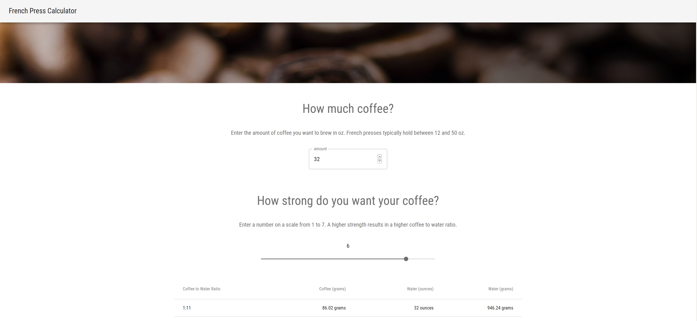

# French Press Calculator

This project is a React web application written in Typescript to calculate french press ratios.




## Run via NodeJS

To run the application in development mode, execute the command

```
npm start
```

To create a production build, execute the command

```
npm run build
```

This will create the build artifacts in a `build` folder. To serve the build assests, install the 
`serve` global node module and run the command

```
serve -s build
```


## Run as a Docker Container

A docker image can be built using the command

```
make docker_build
```

To run the Docker image, execute the command

```
docker run french-press-calculator
```